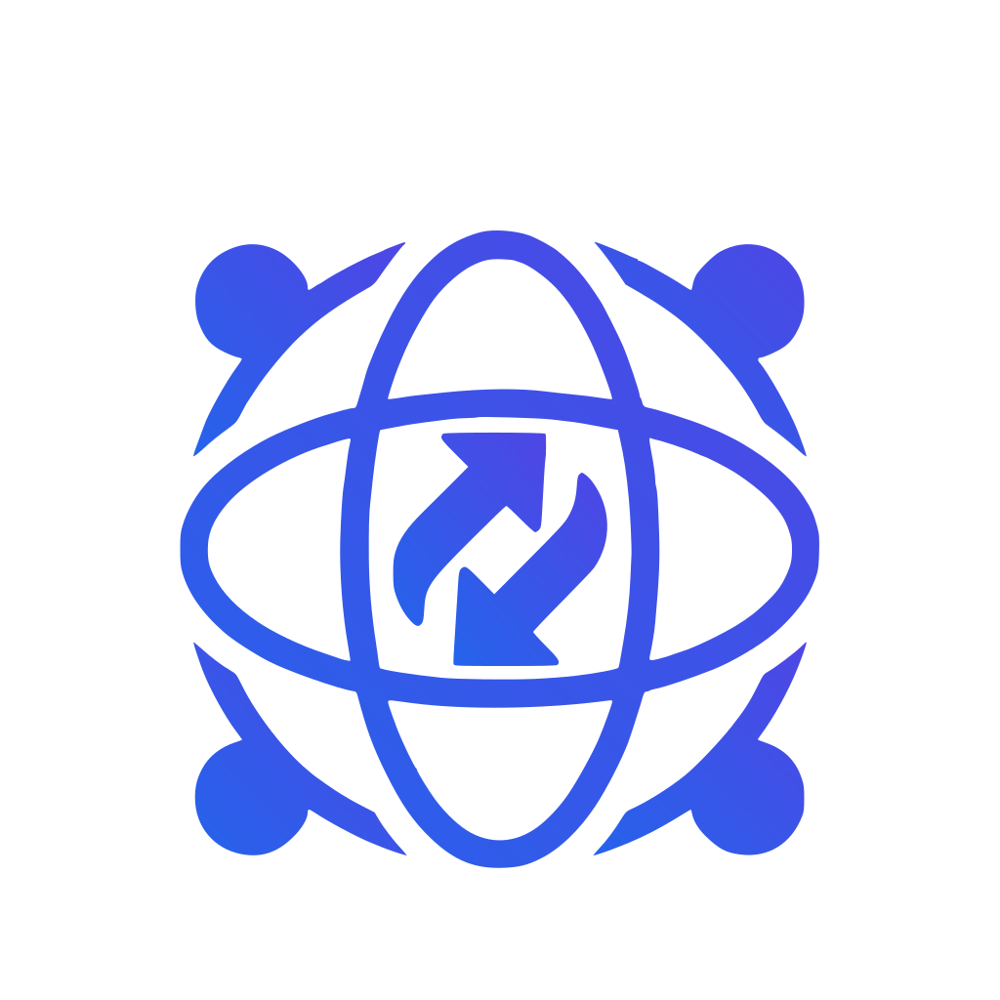
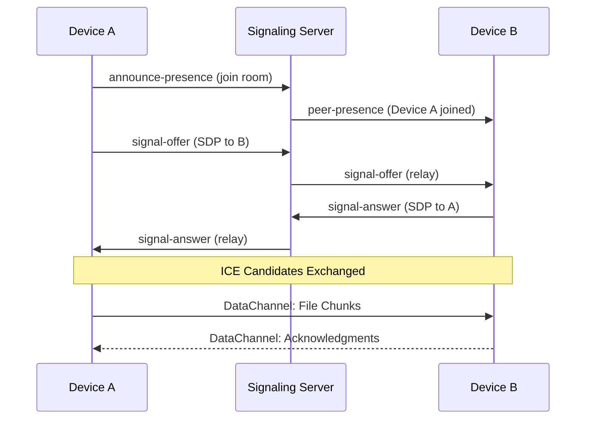
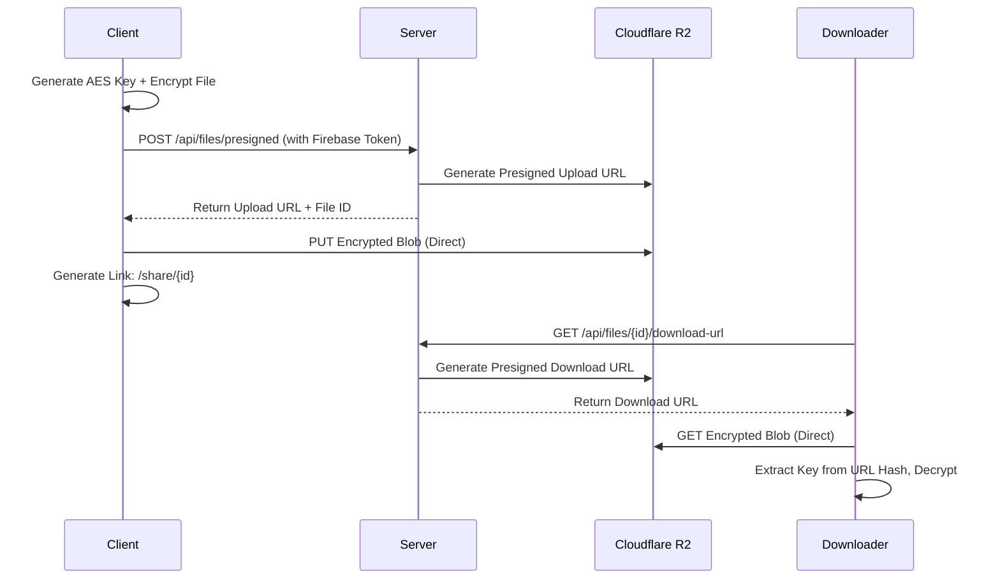

<p align="center">
  
</p>

<h1 align="center">NetDrop</h1>

<p align="center">
  <strong>Enterprise-Grade Peer-to-Peer File Sharing & Secure Cloud Transfer Platform</strong>
</p>

<p align="center">
  <a href="#-features">Features</a> •
  <a href="#-architecture">Architecture</a> •
  <a href="#-quick-start">Quick Start</a> •
  <a href="#%EF%B8%8F-deployment">Deployment</a> •
  <a href="#-api-reference">API Reference</a> •
  <a href="#-security">Security</a> •
  <a href="#-license">License</a>
</p>

<p align="center">
  
  
  
  
  
  
</p>

---

## 📋 Table of Contents

- [Overview](#-overview)
- [Features](#-features)
- [Architecture](#-architecture)
- [Tech Stack](#-tech-stack)
- [Quick Start](#-quick-start)
- [Environment Variables](#-environment-variables)
- [Deployment](#️-deployment)
- [API Reference](#-api-reference)
- [WebSocket Events](#-websocket-events)
- [Security](#-security)
- [Project Structure](#-project-structure)
- [Contributing](#-contributing)
- [License](#-license)

---

## 🎯 Overview

**NetDrop** is a modern, enterprise-grade file sharing platform that combines the speed of local peer-to-peer transfers with the security of encrypted cloud storage. Built as an "AirDrop for the web," it enables seamless file and text sharing between devices on the same network while providing secure cloud upload capabilities for remote sharing.

### Key Differentiators

| Feature | NetDrop | Traditional Cloud | P2P Apps |
|---------|---------|-------------------|----------|
| **Local Transfer Speed** | ✅ Wire-speed via WebRTC | ❌ Limited by upload | ✅ Fast |
| **Zero-Knowledge Encryption** | ✅ Client-side AES-256 | ❌ Server decrypts | ❌ Often unencrypted |
| **No File Size Limits (Local)** | ✅ Unlimited | ❌ Quota-based | ⚠️ Varies |
| **Remote Sharing** | ✅ Encrypted cloud links | ✅ Standard | ❌ Usually none |
| **Cross-Platform** | ✅ Any browser | ⚠️ App-dependent | ❌ Often proprietary |

---

## ✨ Features

### 🔄 Local Peer-to-Peer Transfer
- **Automatic Device Discovery** — Instantly finds devices on the same network using IP-based room isolation
- **WebRTC Data Channels** — Direct browser-to-browser transfer with no server bandwidth usage
- **Chunked File Transfer** — Handles large files with progress tracking and resume capability
- **Text Sharing** — Instantly share text snippets and clipboard content between devices

### ☁️ Secure Cloud Transfer
- **Client-Side Encryption** — Files encrypted with AES-256-GCM before upload; server never sees plaintext
- **Cloudflare R2 Storage** — Enterprise-grade object storage with global CDN
- **Shareable Links** — Generate secure download links with optional passcode protection
- **Presigned URLs** — Time-limited, secure upload/download without exposing credentials

### 🔐 Enterprise Security
- **Zero-Knowledge Architecture** — Encryption keys stored only in shareable link hash (never sent to server)
- **Firebase Authentication** — Google Sign-In with ID token verification
- **PBKDF2 Key Derivation** — Optional passcode protection using 100,000 iterations
- **CORS & Helmet Protection** — Industry-standard HTTP security headers

### 🏠 Room-Based Collaboration
- **Private Rooms** — Create named rooms with auto-generated 6-character passcodes
- **Remote Pairing** — Connect devices across networks using 6-digit pairing codes
- **Real-time Presence** — Live peer list with connection status indicators

### 📱 Progressive Web App
- **Installable** — Add to home screen on mobile and desktop
- **Responsive UI** — Premium glassmorphism design with Framer Motion animations
- **Remote Config** — Firebase-powered version management and feature flags

---

## 🏗 Architecture

```
┌─────────────────────────────────────────────────────────────────────────────┐
│                                  CLIENT                                     │
│  ┌───────────────┐  ┌────────────────┐  ┌─────────────────┐                │
│  │  React 19 +   │  │   WebRTC       │  │   Web Crypto    │                │
│  │  Redux Toolkit│  │   Service      │  │   (AES-GCM)     │                │
│  └───────┬───────┘  └───────┬────────┘  └────────┬────────┘                │
│          │                  │                     │                         │
│          │    ┌─────────────┴─────────────┐      │                         │
│          │    │      Socket.io Client     │      │                         │
│          │    └─────────────┬─────────────┘      │                         │
└──────────┼──────────────────┼────────────────────┼─────────────────────────┘
           │                  │                    │
           │                  │ WebSocket          │ HTTPS
           │                  │                    │
┌──────────┼──────────────────┼────────────────────┼─────────────────────────┐
│          │     SERVER       │                    │                         │
│  ┌───────▼───────┐  ┌───────▼────────┐  ┌───────▼────────┐                │
│  │   Express 5   │  │   Signaling    │  │   File Routes  │                │
│  │   + Helmet    │  │   Service      │  │   (Presigned)  │                │
│  └───────┬───────┘  └───────┬────────┘  └───────┬────────┘                │
│          │                  │                    │                         │
│          │    ┌─────────────┴────────────────────┴─────┐                  │
│          │    │          Service Layer                  │                  │
│          │    │  ┌─────────┐ ┌─────────┐ ┌───────────┐ │                  │
│          │    │  │ Storage │ │ Email   │ │ Firebase  │ │                  │
│          │    │  │ (R2)    │ │(SendGrid)│ │ Admin     │ │                  │
│          │    │  └────┬────┘ └─────────┘ └───────────┘ │                  │
│          │    └───────│─────────────────────────────────┘                  │
└──────────┼────────────┼────────────────────────────────────────────────────┘
           │            │
           │            │
    ┌──────▼──────┐ ┌───▼───────────────┐
    │  MongoDB    │ │  Cloudflare R2    │
    │  (Metadata) │ │  (Encrypted Blobs)│
    └─────────────┘ └───────────────────┘
```

### Data Flow: Local P2P Transfer



### Data Flow: Secure Cloud Upload



---

## 🛠 Tech Stack

### Frontend

| Technology | Version | Purpose |
|------------|---------|---------|
| **React** | 19.2.0 | UI Framework |
| **Redux Toolkit** | 2.11.2 | State Management |
| **Vite** | 7.2.4 | Build Tool & Dev Server |
| **TailwindCSS** | 3.4.1 | Utility-First Styling |
| **Framer Motion** | 12.23.26 | Animations |
| **Socket.io Client** | 4.8.3 | Real-time Communication |
| **Firebase** | 12.7.0 | Auth & Remote Config |
| **Lucide React** | 0.562.0 | Icon System |
| **JSZip** | 3.10.1 | Multi-file Archiving |

### Backend

| Technology | Version | Purpose |
|------------|---------|---------|
| **Node.js** | 18+ | Runtime |
| **Express** | 5.2.1 | HTTP Framework |
| **Socket.io** | 4.8.3 | WebSocket Signaling |
| **Mongoose** | 9.1.1 | MongoDB ODM |
| **AWS SDK (S3)** | 3.962.0 | Cloudflare R2 Client |
| **Firebase Admin** | 13.6.0 | Token Verification |
| **SendGrid** | 8.1.6 | Transactional Email |
| **Helmet** | 8.1.0 | Security Headers |

---

## 🚀 Quick Start

### Prerequisites

- **Node.js** v18 or higher
- **MongoDB** instance (local or Atlas)
- **Cloudflare R2** bucket with API credentials
- **Firebase** project with Google Sign-In enabled

### 1. Clone the Repository

```bash
git clone https://github.com/yourusername/netdrop.git
cd netdrop
```

### 2. Setup Server

```bash
cd server
npm install
cp .env.example .env
# Edit .env with your credentials (see Environment Variables section)
npm run dev
```

### 3. Setup Client

```bash
cd client
npm install
cp .env.example .env
# Edit .env with your credentials (see Environment Variables section)
npm run dev
```

### 4. Access the App

Open `http://localhost:5173` in your browser.

---

## 🔐 Environment Variables

### Server (`server/.env`)

| Variable | Description | Required |
|----------|-------------|----------|
| `PORT` | Server port (default: 5004) | No |
| `MONGO_URI` | MongoDB connection string | Yes |
| `R2_ACCOUNT_ID` | Cloudflare Account ID | Yes |
| `R2_ACCESS_KEY_ID` | R2 API Access Key | Yes |
| `R2_SECRET_ACCESS_KEY` | R2 API Secret Key | Yes |
| `R2_BUCKET_NAME` | R2 Bucket Name | Yes |
| `FIREBASE_SERVICE_ACCOUNT` | Firebase Admin SDK JSON (stringified) | Yes |
| `SENDGRID_API_KEY` | SendGrid API Key | No |
| `CLIENT_URL` | Allowed CORS origin (production) | Yes |

### Client (`client/.env`)

| Variable | Description | Required |
|----------|-------------|----------|
| `VITE_SERVER_URL` | Backend API URL (e.g., `http://localhost:5004/api`) | Yes |
| `VITE_SOCKET_URL` | WebSocket URL (e.g., `http://localhost:5004`) | Yes |
| `VITE_FIREBASE_API_KEY` | Firebase Web API Key | Yes |
| `VITE_FIREBASE_AUTH_DOMAIN` | Firebase Auth Domain | Yes |
| `VITE_FIREBASE_PROJECT_ID` | Firebase Project ID | Yes |
| `VITE_FIREBASE_STORAGE_BUCKET` | Firebase Storage Bucket | Yes |
| `VITE_FIREBASE_MESSAGING_SENDER_ID` | Firebase Messaging Sender ID | Yes |
| `VITE_FIREBASE_APP_ID` | Firebase App ID | Yes |

---

## ☁️ Deployment

NetDrop uses a hybrid deployment strategy optimized for WebSocket support:

| Component | Platform | Reason |
|-----------|----------|--------|
| **Frontend** | Vercel | Global CDN, automatic HTTPS, Vite optimization |
| **Backend** | Render | Persistent WebSocket connections, health checks |

### Production Deployment Guide

See [deployment_guide.md](./deployment_guide.md) for detailed step-by-step instructions.

### Quick Deployment Checklist

1. **Backend (Render)**
   - Create Web Service with `server` as root directory
   - Set all environment variables
   - Build: `npm install` | Start: `npm start`
   - Note the deployment URL

2. **Frontend (Vercel)**
   - Create project with `client` as root directory
   - Set `VITE_SERVER_URL` to `https://your-render-url.onrender.com/api`
   - Set `VITE_SOCKET_URL` to `https://your-render-url.onrender.com`
   - Add all Firebase environment variables

3. **Keep-Alive** (Free Tier)
   - Use [cron-job.org](https://cron-job.org) to ping `/health` every 14 minutes

---

## 📡 API Reference

### Base URL

```
Production: https://your-server.onrender.com/api
Development: http://localhost:5004/api
```

### Endpoints

#### Health Check

```http
GET /health
```

**Response:**
```json
{
  "status": "ok",
  "timestamp": "2026-01-11T16:11:27.000Z"
}
```

#### Get Presigned Upload URL

```http
POST /api/files/presigned
Authorization: Bearer <Firebase ID Token>
Content-Type: application/json

{
  "fileName": "document.pdf",
  "contentType": "application/pdf",
  "email": "user@example.com",
  "passcodeHash": "optional-hashed-passcode"
}
```

**Response:**
```json
{
  "uploadUrl": "https://bucket.r2.cloudflarestorage.com/...",
  "fileId": "abc123",
  "key": "uploads/abc123-document.pdf"
}
```

#### Get Download URL

```http
GET /api/files/:id/download-url
```

**Response:**
```json
{
  "downloadUrl": "https://bucket.r2.cloudflarestorage.com/...",
  "fileName": "document.pdf",
  "uploaderEmail": "user@example.com"
}
```

#### Submit Feedback

```http
POST /api/feedback
Content-Type: application/json

{
  "type": "bug|feature|general",
  "message": "Feedback content",
  "email": "optional@email.com"
}
```

---

## 🔌 WebSocket Events

### Client → Server

| Event | Payload | Description |
|-------|---------|-------------|
| `announce-presence` | `{ deviceName, deviceType, ... }` | Register device in room |
| `create-room` | `{ roomName }` | Create private room |
| `join-room-by-code` | `{ passcode }` | Join room with 6-char code |
| `leave-room` | — | Return to local network room |
| `create-pair-code` | — | Generate 6-digit pairing code |
| `join-with-code` | `code` | Pair with remote device |
| `signal-offer` | `{ targetId, offer }` | WebRTC SDP offer |
| `signal-answer` | `{ targetId, answer }` | WebRTC SDP answer |
| `signal-ice-candidate` | `{ targetId, candidate }` | ICE candidate |
| `broadcast-room-text` | `{ text, sender }` | Share text in room |

### Server → Client

| Event | Payload | Description |
|-------|---------|-------------|
| `peer-presence` | `{ id, deviceName, ... }` | New peer joined |
| `peer-left` | `{ id }` | Peer disconnected |
| `active-peers` | `[{ id, deviceName, ... }]` | Current room members |
| `pair-code-created` | `code` | 6-digit code generated |
| `pair-success` | `{ peer }` | Pairing successful |
| `pair-error` | `message` | Pairing failed |
| `room-text-received` | `{ text, sender }` | Text broadcast received |
| `signal-offer` | `{ senderId, offer }` | Incoming WebRTC offer |
| `signal-answer` | `{ senderId, answer }` | Incoming WebRTC answer |
| `signal-ice-candidate` | `{ senderId, candidate }` | Incoming ICE candidate |

---

## 🔒 Security

### Zero-Knowledge Encryption

1. **Key Generation** — AES-256-GCM key generated client-side using Web Crypto API
2. **Encryption** — File encrypted in browser before any network transfer
3. **Key Transport** — Key embedded in URL hash fragment (`#key=...`), never sent to server
4. **Decryption** — Recipient extracts key from URL, decrypts downloaded blob

### Authentication Flow

```
User → Google Sign-In → Firebase ID Token → Server Verification → Firebase Admin SDK
```

### Password Protection (Optional)

- Uses **PBKDF2** with 100,000 iterations and SHA-256
- Salt generated per-file using `crypto.getRandomValues()`
- Key derived client-side; server stores only salted hash for validation

### Security Headers

Enabled via Helmet.js:
- X-Content-Type-Options
- X-Frame-Options
- X-XSS-Protection
- Referrer-Policy
- Strict-Transport-Security (production)

---

## 📁 Project Structure

```
netdrop/
├── client/                     # React Frontend
│   ├── public/                 # Static assets (PWA icons, manifest)
│   ├── src/
│   │   ├── components/
│   │   │   ├── Auth/           # Login component
│   │   │   ├── Common/         # Footer, shared UI
│   │   │   ├── Navigation/     # Header, mobile nav
│   │   │   ├── Remote/         # Cloud upload, pairing
│   │   │   ├── Rooms/          # Room management
│   │   │   ├── Transfer/       # P2P discovery, modals
│   │   │   └── UI/             # Reusable UI components
│   │   ├── config/             # Firebase configuration
│   │   ├── hooks/              # Custom React hooks
│   │   ├── services/           # API, Crypto, Socket, WebRTC
│   │   ├── store/              # Redux slices
│   │   ├── App.jsx             # Main application
│   │   └── main.jsx            # Entry point
│   ├── index.html
│   ├── vite.config.js
│   └── tailwind.config.js
│
├── server/                     # Node.js Backend
│   ├── config/                 # Database, Firebase config
│   ├── controllers/            # Route handlers
│   ├── middleware/             # Auth middleware
│   ├── models/                 # Mongoose schemas
│   ├── routes/                 # Express routes
│   ├── services/               # Signaling, Storage, Email
│   └── index.js                # Server entry point
│
├── deployment_guide.md         # Production deployment guide
└── README.md                   # This file
```

---

## 🤝 Contributing

Contributions are welcome! Please follow these steps:

1. **Fork** the repository
2. **Create** a feature branch: `git checkout -b feature/amazing-feature`
3. **Commit** your changes: `git commit -m 'Add amazing feature'`
4. **Push** to the branch: `git push origin feature/amazing-feature`
5. **Open** a Pull Request

### Development Guidelines

- Follow existing code style (ESLint configured)
- Write meaningful commit messages
- Update documentation for new features
- Test across multiple browsers

---

## 🙏 Acknowledgements

This project was built with the assistance of AI-powered development tools:

- **[Google Gemini](https://gemini.google.com)** — For UI/UX design improvements, code architecture guidance, and comprehensive documentation generation
- **[OpenAI ChatGPT](https://chat.openai.com)** — For UI/UX enhancements, debugging assistance, and feature implementation support

These AI assistants significantly accelerated development and helped achieve a premium, polished user experience.

---

## 📄 License

This project is licensed under the **MIT License** — see the [LICENSE](LICENSE) file for details.

---

<p align="center">
  <strong>Built with ❤️ for seamless, secure file sharing</strong>
</p>

<p align="center">
  <a href="https://netdrop.site">Live Demo</a> •
  <a href="https://github.com/yourusername/netdrop/issues">Report Bug</a> •
  <a href="https://github.com/yourusername/netdrop/issues">Request Feature</a>
</p>
